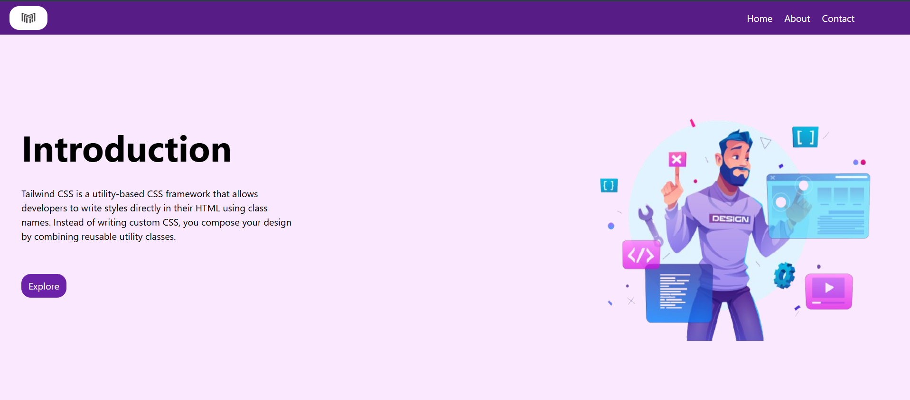

# 🌟 Tailwind CSS Demo Landing Page

This is a simple landing page created using **Tailwind CSS** as a part of my journey to master the framework. It demonstrates the basics of styling with Tailwind's utility-first approach and serves as an introduction to the framework.

---

## 🖥️ Preview



---

## 🚀 About the Project

This project is a demonstration of how **Tailwind CSS** can be used to quickly build a responsive and visually appealing web page.

### Features:

- **Navigation Bar**: A sleek navigation bar with logo and links.
- **Introduction Section**:
  - A bold heading and an introduction paragraph explaining Tailwind CSS.
  - A call-to-action button styled with hover effects.
- **Responsive Design**: Ensures compatibility across devices.
- **Image Section**: Includes an image showcasing coding or related visuals.

---

## 🛠️ Technologies Used

- **HTML5**: Structuring the content.
- **Tailwind CSS**: For utility-based styling and layout.

---

## 📚 What I Learned

- **Utility-First Workflow**: Using Tailwind's predefined classes to style elements directly in the HTML.
- **Hover Effects**: Adding interaction to buttons using `hover:` classes.

---

## 📋 How to Use

1. Clone this repository:
   ```bash
   git clone https://github.com/Rajdeep-Joshi-09/tailwind-demo.git
   cd tailwind-demo
   ```
