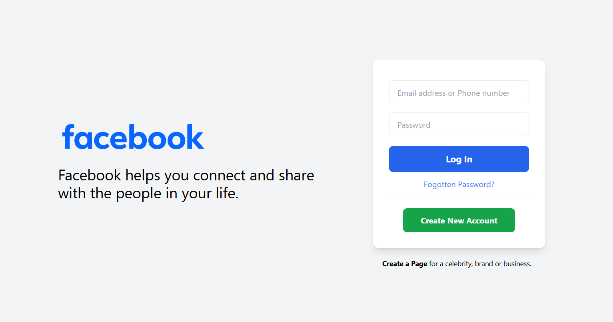

# Facebook Login Clone

This project is a **Facebook Login Clone** created using **Tailwind CSS**. It replicates the design and functionality of the Facebook login page with a responsive layout.

---

## **Features**

- Built entirely with **Tailwind CSS** utility classes.
- Clean and minimalistic code structure.

---

## **Preview**



Check out the preview in the `assets` folder for a glimpse of the UI design.

---

## **Setup Instructions**

1. Clone this repository:
   ```bash
   git clone <repository_url>
   ```
2. Navigate to the project directory:
   ```bash
   cd facebook-login-clone
   ```
3. Install dependencies:
   ```bash
   npm install
   ```
4. Start the development server:
   ```bash
   npm run dev
   ```

---

## **Built With**

- **Tailwind CSS**: For fast and responsive styling.

---

## **License**

This project is open-source and free to use. 🌟
